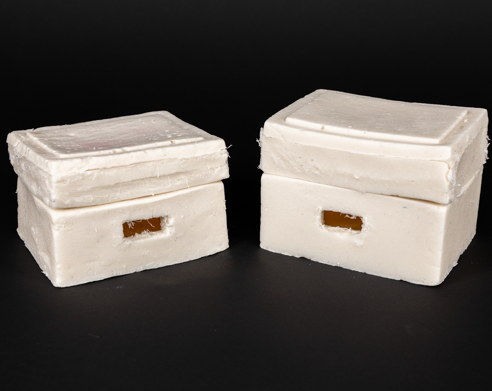

# Overstimulated Tofu

> A responsive bio-material organism that reacts to human proximity through movement, simulating overstimulation in an increasingly crowded environment.

---

## Main Image

<p align="center">
  
</p>

---

## Overview

**Overstimulated Tofu** is an interactive bio-material sculpture built from an agar-agar biocomposite shell embedded with electronics.

Using an IR or Ultrasonic distance sensor, the organism senses nearby human presence and responds with a servo-driven breathing mechanism that contracts as someone approaches or remains nearby. The project explores how living systems respond to sensory overload, translating overstimulation into physical movement through soft materials and embodied interaction.

---

## How It Works

1. The IR or Ultrasonic distance sensor continuously measures proximity.
2. Human presence is mapped to behavioral states.
3. The servo actuates
4. As users approach or linger, the organism contracts, simulating an overstimulated response.

---

## Repository Structure

```txt
├── code/                # Arduino / microcontroller code
├── assets/              # Images, videos, documentation
└── README.md
```

*(Update structure to match your repo.)*

---

## Demo

Add video, gif, or interaction demo here.

```

```
---

## Process

This project combines:

- Physical computing
- Soft mechanisms
- Bio-material experimentation
- Interactive behavior design
- Critical design around sensory overload and human-environment relationships

---

## Portfolio

View the full project documentation, process, and additional work on my portfolio:

🔗 **Portfolio:** [liyahcoleman.studio](https://www.liyahcoleman.studio/home/project-archive/overstimulated-tofu)

---

Creative Technologist • Interactive Design • Physical Computing
